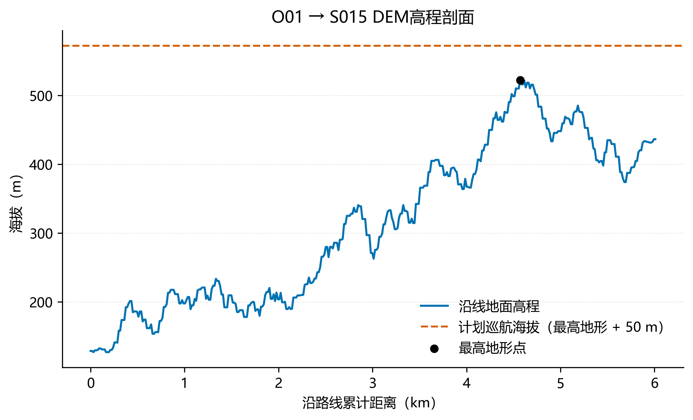

# D题基础计算器实现与验证报告

> 项目：第二十三届中国研究生数学建模竞赛 D 题——山区洪涝灾害下无人机运输与通信协同优化  
> 文档日期：2026年9月23日  
> 当前阶段：基础航段计算器已经实现并通过测试

## 1. 项目目标

本阶段的目标是建立一个可复用、可验证的底层航段计算器，为后续运输任务分组、航线规划、电池排程和通信中继优化提供统一的计算基础。

计算器接收以下四项输入：

- 起点节点；
- 终点节点；
- 运输无人机型号；
- 当前载荷质量。

并返回航段距离、地形最高点、计划巡航高度、爬升与下降高度、分阶段飞行时间、等效航程以及能耗估计。

当前范围严格限定为**单个航段的基础计算**，暂不包含货箱组批、车辆路径规划、任务调度、电池更换、通信中继或启发式优化算法。

## 2. 需求完成情况

| 序号 | 要求 | 完成情况 | 对应成果 |
|---:|---|:---:|---|
| 1 | 自动读取题目基础数据 | 已完成 | `src/data_loader.py` |
| 2 | 读取并校验 DEM 地理信息 | 已完成 | `src/dem_utils.py` |
| 3 | 计算节点间测地距离 | 已完成 | WGS84 椭球测地线计算 |
| 4 | 沿航线采样并寻找最高地形 | 已完成 | 默认每 15 m 采样一次 |
| 5 | 计算巡航高度及升降高度 | 已完成 | 航线最高地形上方 50 m |
| 6 | 计算爬升、巡航、下降时间 | 已完成 | `src/flight_calculator.py` |
| 7 | 按载荷计算等效航程 | 已完成 | 使用题面给出的等效航程公式 |
| 8 | 给出航段能耗估计 | 已完成，需复核公式 | 已将推定公式独立封装 |
| 9 | 批量生成节点对结果与示例 | 已完成 | `outputs/*.csv` |
| 10 | 编写测试并验证输出 | 已完成 | 7 项测试全部通过 |

## 3. 数据来源

程序从赛题目录中自动定位并读取以下数据：

- `调度中心与服务区.xlsx`：调度中心、服务区的编号、经纬度和地面高程；
- `运输无人机数据.xlsx`：A、B、C 三种运输无人机的载荷、速度、航程、能量和作业参数；
- `镇龙乡及周边30米DEM.tif`：航线沿途地形高程；
- `镇龙乡地理空间数据说明.pdf`：DEM 坐标系、像元含义和无效值说明；
- 赛题正文：作业高度、巡航安全余量、飞行时间和等效航程等计算规则。

默认赛题根目录配置在 `src/config.py`，也可以通过环境变量 `D_PROBLEM_ROOT` 或命令行参数覆盖。

## 4. 基础计算规则

### 4.1 节点作业高度

- 调度中心 O01 的作业海拔取地面海拔；
- 服务区的作业海拔取地面海拔加 30 m。

记起点和终点的作业海拔分别为 \(H_s\) 和 \(H_e\)。

### 4.2 航线距离与地形

节点之间的水平距离采用 WGS84 椭球上的测地线距离。程序沿测地航线以不超过 15 m 的间隔采样，并查询各采样点对应的 DEM 高程。

设航线有效采样点的最高地形海拔为 \(H_{\max}\)，则计划巡航海拔为：

$$
H_c=H_{\max}+50.
$$

其中，50 m 为题目规定的地形安全余量。DEM 中数值为 -32767 的像元视为 NoData，不参与最高高程统计。

### 4.3 爬升和下降高度

$$
h_{\mathrm{climb}}=\max(0,H_c-H_s),
$$

$$
h_{\mathrm{descend}}=\max(0,H_c-H_e).
$$

### 4.4 飞行时间

总飞行时间由爬升、水平巡航和下降三部分组成：

$$
t_{\mathrm{total}}
=\frac{h_{\mathrm{climb}}}{v_{\mathrm{climb}}}
+\frac{L}{v_{\mathrm{cruise}}}
+\frac{h_{\mathrm{descend}}}{v_{\mathrm{descend}}},
$$

其中：

- \(L\) 为水平测地距离；
- \(v_{\mathrm{climb}}\) 为最大爬升速度；
- \(v_{\mathrm{cruise}}\) 为计划巡航速度；
- \(v_{\mathrm{descend}}\) 为最大下降速度。

### 4.5 载荷对应的等效航程

题面给出的等效航程公式为：

$$
L_g(q)=L_g^0-\left(L_g^0-L_g^F\right)
\left(\frac{q}{Q_g}\right)^{3/2},
$$

其中：

- \(q\) 为当前载荷质量；
- \(Q_g\) 为该机型最大载货质量；
- \(L_g^0\) 为空载标准航程；
- \(L_g^F\) 为满载标准航程。

程序会检查 \(0\le q\le Q_g\)。负载荷、非有限数值或超载输入都会返回明确错误。

### 4.6 能耗估计及重要说明

题面明确总能耗由水平飞行能耗和爬升附加能耗构成：

$$
E_{\mathrm{total}}=E_{\mathrm{horizontal}}+E_{\mathrm{climb}}.
$$

但现有题面材料没有明确给出两个分项的完整公式。为使计算器可运行，当前采用以下可复核解释：

$$
E_{\mathrm{horizontal}}
=E_{\mathrm{use}}\frac{L}{L_g(q)},
$$

$$
E_{\mathrm{climb}}
=\frac{(m_0+q)g h_{\mathrm{climb}}}
{\eta_{\mathrm{climb}}\times 3\,600\,000}.
$$

其中 \(E_{\mathrm{use}}\) 为电池可用能量，\(m_0\) 为含电池空载质量，\(g=9.80665\ \mathrm{m/s^2}\)，\(\eta_{\mathrm{climb}}\) 为爬升能耗效率。

> **公式待人工核对：**上述两个分项公式是依据等效航程和能量效率的量纲关系作出的工程解释，不应表述为题面已明确给出的公式。正式提交前，应依据命题方补充说明或权威资料再次核验。对应代码已集中在 `horizontal_energy_kwh()` 和 `climb_energy_kwh()` 中，核验后可单点替换。

## 5. 程序结构

```text
数学建模/
├─ src/
│  ├─ config.py               # 路径、常数和统一规则
│  ├─ data_loader.py          # 节点及无人机参数读取
│  ├─ dem_utils.py            # DEM读取、测地线采样与高程查询
│  └─ flight_calculator.py    # 单航段计算核心
├─ tests/
│  └─ test_flight_calculator.py
├─ outputs/
│  ├─ node_pair_geometry.csv
│  ├─ segment_demo.csv
│  ├─ segment_cost_demo.csv
│  ├─ demo_elevation_profile.png
│  ├─ demo_elevation_profile.svg
│  └─ demo_elevation_profile_grayscale.png
├─ generate_outputs.py
├─ requirements.txt
└─ README_base_calculator.md
```

## 6. 核心调用方法

```python
from src.flight_calculator import calculate_segment

result = calculate_segment(
    start_node="O01",
    end_node="S001",
    model_id="A",
    payload_kg=20.0,
)
```

返回结果中所有物理量均带有单位后缀：

- 距离、高程、高度：`_m`；
- 时间：`_s`；
- 质量：`_kg`；
- 能量：`_kwh`；
- 经纬度：`_deg`。

## 7. 示例结果

示例条件为：O01 → S001，A 型运输无人机，载荷 20 kg。

| 指标 | 计算结果 |
|---|---:|
| 水平距离 | 3053.979 m |
| 航线最高地形海拔 | 223.057 m |
| 计划巡航海拔 | 273.057 m |
| 爬升高度 | 145.357 m |
| 下降高度 | 89.057 m |
| 爬升时间 | 48.452 s |
| 巡航时间 | 254.498 s |
| 下降时间 | 35.623 s |
| 总飞行时间 | 338.573 s |
| 等效航程 | 21422.291 m |
| 水平能耗估计 | 0.641524 kWh |
| 爬升能耗估计 | 0.049495 kWh |
| 总能耗估计 | 0.691019 kWh |

完整精度结果见 `outputs/segment_demo.csv`。

## 8. 航线高程剖面

下图用于核查 DEM 采样、最高地形点和计划巡航高度之间的关系：



同时提供 SVG 矢量版本和灰度预览版本，便于论文排版及打印检查。

## 9. 批量输出

### 9.1 节点对几何结果

`outputs/node_pair_geometry.csv` 包含 16 个节点之间的 240 个有向节点对，主要字段包括：

- 起终点编号及坐标；
- 起终点地面海拔；
- 水平距离；
- 航线最高地形海拔及位置；
- 计划巡航海拔；
- 起终点作业海拔；
- 爬升和下降高度。

### 9.2 航段成本示例

`outputs/segment_cost_demo.csv` 包含 4 条典型路线、3 种机型和 3 个载荷水平，共 36 条计算记录，用于比较不同机型、载荷和地形条件对时间与能耗的影响。

## 10. 验证结果

已运行自动化测试：

```powershell
python -B -m pytest -q -p no:cacheprovider
```

测试结果：

```text
7 passed
```

覆盖内容包括：

1. O01 → S001 空载计算；
2. 接近最大载荷时等效航程下降、能耗增加；
3. 不同方向和不同海拔服务区的地形差异；
4. S001 → S002 的非调度中心航段；
5. 负载荷和超载输入的异常处理；
6. DEM 采样间隔、最高点和剖面数据的一致性；
7. 16 个节点、240 个有向节点对的完整性。

另对批量结果进行了完整性审计：所有节点对距离均为有限数值，巡航海拔均满足“最高地形海拔 + 50 m”，反向节点对的测地距离保持一致。

## 11. 运行方式

安装依赖：

```powershell
python -m pip install -r requirements.txt
```

运行测试：

```powershell
python -B -m pytest -q -p no:cacheprovider
```

重新生成全部输出：

```powershell
python generate_outputs.py
```

也可显式指定赛题目录和输出目录：

```powershell
python generate_outputs.py `
  --problem-root "D:\比赛\第二十三届中国研究生数学建模竞赛 - 中文题目\中文题目\D题" `
  --output-dir outputs
```

## 12. 当前结论与后续工作

基础航段计算器已经完成，可以直接作为问题一及后续优化模型的底层成本函数。距离、DEM、巡航高度、作业高度、升降时间和等效航程均有明确题面依据并已通过测试。

后续进入正式优化前，建议按以下顺序推进：

1. 核验水平飞行能耗和爬升附加能耗的最终公式；
2. 计算各“机型—服务区”组合的最大安全载荷；
3. 将物资需求拆分或组批为可运输任务；
4. 以本计算器输出作为航段成本，建立问题一的任务分配与路径优化模型；
5. 再叠加电池、配送时限和通信覆盖等约束。

